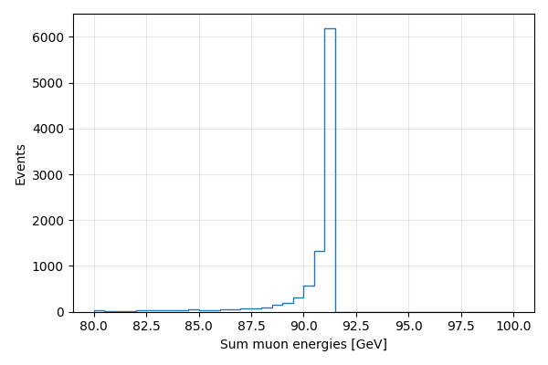

# Further technical test

---

## Content of the repository

The respository contains under `data/` the file `dimuon_91.txt` with the particles generted by Pythia8 in the simulation of 10000 e+e- -> mu+mu- events at sqrt(s) = 91.2 GeV.
The format is ASCII. Each line starts either by letter 'E' or letter 'P'.
The letter 'E' indicates the beginning of an event and it is followed by the event number and
some other information on the event.
The letter 'P' indicates a particle; it is followed by some information which includes the particle type (as per PDG), third integer after initial letter, the momentum along the three axis (x,y,z),
the energy, the mass, and the status. Status 1 means stable.

---

## Task 1
Under `f77/` you can find the program `convertMC.F`, which is a fortran77 program reading the file `data/dimuon_91.txt`, printing each line and counting the number of events.
You can compile it in thsi way:
```
$ gfortran -o f77/convertMC f77/convertMC.F
```
and run it
```
$ ./f77/convertMC
...
 DONE!        10000
```

The task consist in modifying the code to write into a separate file under `data` the event number and the relevant information for the stable particles only.
The output file should be identical to the reference file `data/dimuon_91_stable.txt`. Note that the lines have not the same format.

### Implementation 
The original program reads the input file line by line, prints each line to the terminal, and counts the number of events by checking for lines starting with `E`.

This implementation was extended to instead parse the input and write a new output file `data/dimuon_91_stable_task1.txt`, containing the filtered relevant information for stable particles, matching the format of the reference file `data/dimuon_91_stable.txt`.

The main modifications are:

- An output file is opened and written to instead of printing to standard output.
- Each line is inspected to distinguish between event (`E`) and particle (`P`).
- For event lines, the event number is extracted and written in the required format.
- For particle lines, the kinematic variables are read and only written if the particle has `STATUS = 1` (stable particles).

The formatting and number of digits in the refrence file depends on the magnitude so using the same format descriptor for each kinematic object in each event, i.e `,5(1x,G24.16E3)` did not work. I extracted the following structure from the refrence file: 

- `VAL == 0.0`  
  Values are written in fixed-point notation with **16 digits after the decimal point**.

- `|VAL| < 0.1`  
  Values are written in scientific notation with **16 digits after the decimal point**.

- `0.1 ≤ |VAL| < 1.0`  
  Values are written in fixed-point notation with **17 digits after the decimal point**.

- `1 ≤ |VAL| < 10.0`  
  Values are written in fixed-point notation with **16 digits after the decimal point**.

- `|VAL| ≥ 10.0`  
  Values are written in fixed-point notation with **15 digits after the decimal point**. The last trailing zero is also removed to match the refrence file formatting. 

This formatting is explicitly implemented in the `FMT` function in `convertMC.F`, which applies the magnitude-dependent rules described above.

To validate the output `data/dimuon_91_stable_task1.txt`, I used the `diff` command. The comparison returns no differences:

```bash
diff data/dimuon_91_stable_task1.txt data/dimuon_91_stable.txt
```

## Task 2
Under `cpp/`, `Event.h` defines a simplified Event class which you van load in `ROOT`:
```
$ root -l
root [0] .L cpp/Event.h++
Info in <TUnixSystem::ACLiC>: creating shared library /home/ganis/aleph/GIT/TechTest/./cpp/Event_h.so
root [1] .q
```
The task consists in writing a ROOT macro that reads the output of the previous program, i.e. `data/dimuon_91_stable.txt ` and creates a `ROOT TTree` of `Event` entries and saves it to a file.

### Implementation
Created a new macro `cpp/buildTree.C` that reads the input text file `data/dimuon_91_stable_task1.txt` and constructs a `TTree` named `events`, where each entry corresponds to one `Event` object. The output is written to the file `data/dimuon_91.root`:

```bash
root -l -b -q 'cpp/buildTree.C' 
Info in <buildTree>: Wrote 10000 events to data/dimuon_91.root
```

The macro processes the file line by line:

- If `E:` line:
  - the previous event is written to the tree (if any)
  - the current `Event` object is cleared and assigned a new event ID
- If `P:` line:
  - a `Particle` object is constructed from the kinematics
  - it is added to the current `Event`

A single `Event` object is reused during the loop, and `tree->Fill()` stores a copy of its content for each completed event. 

After the loop, the final event is written to the tree.


## Task 3
This task consist in writing a script or macro to visualise the sum of the muon energies. You can use whatever tool you want. Put the macro in the top directory.

### Implementation 
Created a plotter/visualiser in Python that reads `data/dimuon_91.root` using `uproot` and `awkward`, and accesses the particle kinematics in the `events` tree. The muon energies in each event are summed and plotted with `matplotlib` in a histogram with a range centred around the Z mass (91.2 GeV). 
```bash
python plot_muon_energies.py
Done! Plot saved to plots/sum_muon_energy.png
```
#### Result:



---
## Notes
1. You can use whatever tools you prefer to find a solution. During the discussion you have to be ready to demonstrate to understand what you have provide,
possibly being ready to implement some modifications
2. Fork the repository in your own area and provide access to your own version of the repository for us to examine and run your solutions
